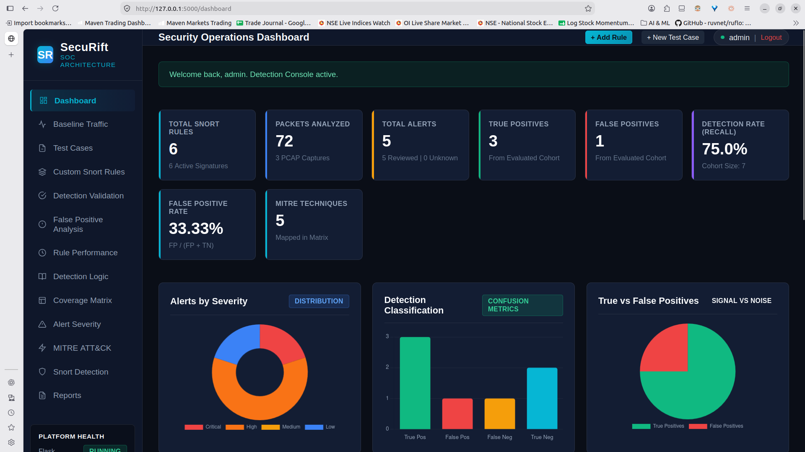
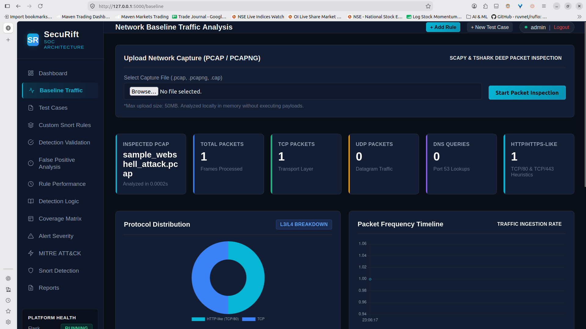
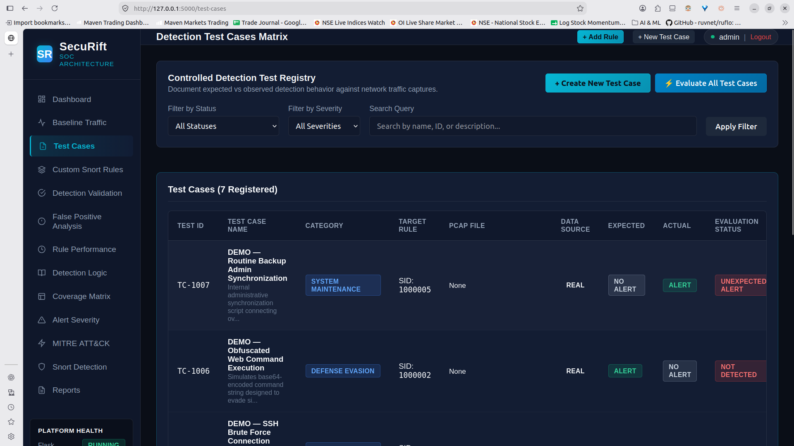
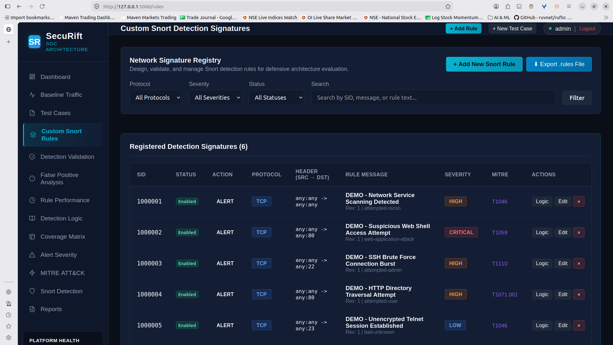
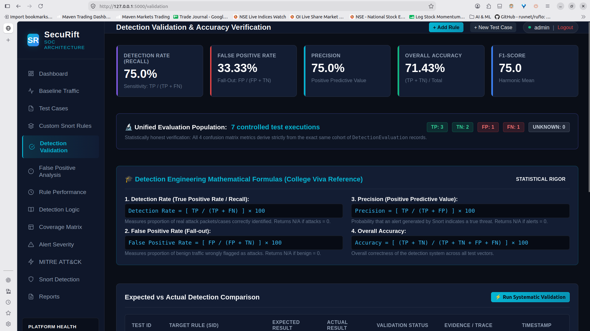
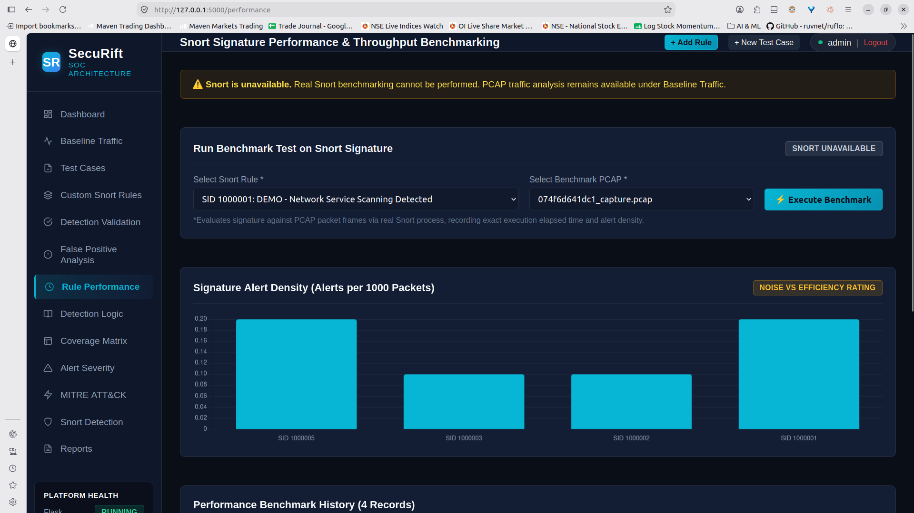
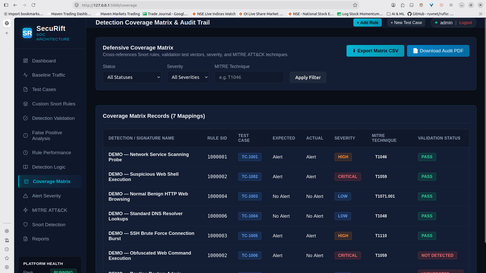
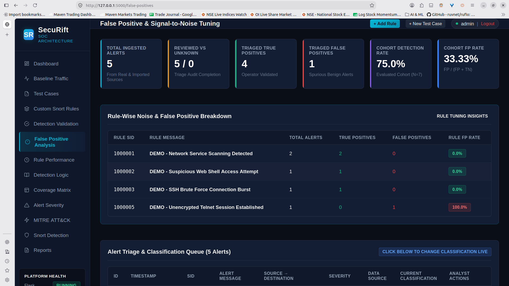
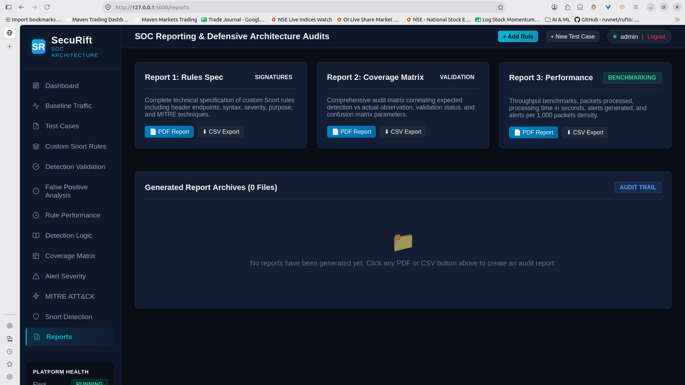

# SecuRift — Advanced Network Defence & Detection Engineering Platform

> **Academic Classification:** Academic Defensive Network Detection-Engineering and SOC Validation Platform  
> **Project Subject:** Advanced Network Defence and Security Architecture  
> **Academic Level:** TYBCA Semester 5 Cybersecurity Project  
> **Operational Stance:** Strictly Defensive Network Monitoring, Detection Validation & SOC Triage

---

## 1. Project Overview & Defensive Mission

**SecuRift** is an academic defensive network detection-engineering and SOC validation platform built to bridge the gap between network packet inspection, signature authoring, and detection accuracy quantification.

In enterprise Security Operations Centers (SOC), detection engineers cannot merely write rules; they must empirically evaluate signature efficiency, detect gaps (False Negatives), quantify noise (False Positives), benchmark processing throughput against network packet captures, and map coverage to adversary techniques.

### 🛡️ Core Defensive Mandate
SecuRift is **DEFENSIVE ONLY**. It does **NOT** contain:
- Attack generators or exploit execution modules
- Port scanners, SYN flooders, or packet crafters
- Brute-force tools or denial-of-service triggers
- Malware droppers or credential stuffing utilities

All evaluations are conducted against controlled, pre-recorded PCAP files or authenticated external Snort alert logs.

---

## 2. System Architecture

```
                                  +-------------------------------------------------+
                                  |              SecuRift Web Platform              |
                                  |   (Flask 3.1, Flask-Login, Flask-WTF, SQLite3)  |
                                  +-------------------------------------------------+
                                                           |
           +-------------------------------+---------------+-------------------------------+
           |                               |                               |               |
           v                               v                               v               v
  +------------------+           +-------------------+           +------------------+ +----------+
  |  PCAP Inspection |           |  Snort Engine     |           | Detection Logic  | | Reports  |
  |  (Scapy/tshark)  |           |  Execution Link   |           | & Validation     | | (PDF/CSV)|
  +------------------+           +-------------------+           +------------------+ +----------+
           |                               |                               |               |
           v                               v                               v               v
 [Packet Frame Analysis]         [Snort Process / Subproc]       [Unified Population]  [ReportLab]
 - Magic bytes header check      - SnortExecution entity         - TestExecution       - Audited
 - Collision-safe UUID storage   - Real vs Demo separation       - DetectionEvaluation - Lineage
 - Port-correlated heuristics    - Alert.snort_execution_id      - TP / TN / FP / FN   - Badges
```

### Key Architectural Layers:
1. **Presentation Layer:** Responsive dark SOC interface built with Vanilla CSS3 design tokens and Chart.js dashboards.
2. **Access Control & Web Security Layer:** Flask-Login session management, Flask-WTF CSRF tokens on all state-altering forms, open-redirect mitigation, and role-based access control (`Administrator`, `Reviewer`, `Analyst`).
3. **Packet Dissection Engine:** Scapy-based L3/L4 packet inspection with strict file validation (magic byte detection, 50MB ceiling, unique UUID storage).
4. **Snort Execution Harness:** Subprocess manager executing Snort rules against PCAPs when the binary is present; tracks `SnortExecution` and `TestExecution` entities.
5. **Detection Metrics Engine:** Evaluates confusion matrix parameters strictly across a unified evaluation cohort with mathematical zero-division protection (`N/A`).
6. **Reporting Engine:** Vector PDF generation via ReportLab and CSV exports with audit trail markers.

---

## 3. Data Flow

```
[Network Capture (.pcap)] ──> validate_pcap_file_structure() ──> Stored with UUID prefix
                                         |
                                         v
                            analyze_pcap_file() [Scapy]
                                         |
                                         v
                             PCAPAnalysis Record Created
                                         |
[Snort Rule (SID)] ──────────> run_snort_on_pcap() [Actual Snort Binary]
                                         |
                                         v
                              SnortExecution Record
                     (execution_type = REAL_SNORT | DEMO_SIMULATION)
                                         |
                                         v
                              Alerts Ingested / Linked
                        (Alert.snort_execution_id = SnortExecution.id)
                                         |
                                         v
                            test_cases.evaluate_single()
                                         |
                                         v
                                TestExecution Record
                                         |
                                         v
                            DetectionEvaluation Record
                           (TP, TN, FP, FN, or UNKNOWN)
                                         |
                                         v
                         compute_metrics_from_evaluations()
                                         |
                                         v
                    Dashboard, Validation Table & PDF/CSV Reports
```

---

## 4. Detection Engineering Methodology

To ensure technical defensibility during academic review and SOC operations, SecuRift adheres to eight methodological principles:

1. **PCAP Traffic Analysis vs. Deep Inspection:** PCAP packet inspection is performed locally using Scapy. Application protocols correlated with standard ports are labeled transparently (e.g. `HTTP-like (TCP/80)` and `HTTPS/TLS-like (TCP/443)`). Port correlation is never misrepresented as full application-layer reassembly.
2. **Real Snort Detection vs Fallback:** Snort detection benchmarking is executed **only** when the `snort` binary is installed and operational.
3. **Imported Snort Logs:** Alerts imported from external `fast.log` files are labeled with data source `IMPORTED_SNORT_LOG` and never claimed to be live executions.
4. **Demonstration Data Separation:** Seeded records are explicitly tagged `DEMO` or `DEMO_SIMULATION`. Real measurements are never mixed with demonstration data.
5. **Controlled Evaluation Population:** Confusion matrix metrics derive exclusively from `DetectionEvaluation` records belonging to the same evaluation cohort.
6. **Explicit False Positive Triage:** Unreviewed alerts remain `UNKNOWN`. An alert is only classified as `True Positive` or `False Positive` when an operator explicitly reviews it.
7. **MITRE ATT&CK Rationale:** Technique mappings reflect documented detection logic based on observable network artifacts, not forensic proof of threat actor attribution.
8. **Empirical Benchmarks:** Rule performance measurements require actual Snort runs; alerts are never estimated from packet counts.

---

## 5. Statistical Metric Formulas

All metrics derive strictly from `DetectionEvaluation` records. Safe division returns `N/A` rather than misleading percentages when denominators are zero.

$$\text{Detection Rate (Recall)} = \frac{\text{TP}}{\text{TP} + \text{FN}} \times 100$$

$$\text{Precision (PPV)} = \frac{\text{TP}}{\text{TP} + \text{FP}} \times 100$$

$$\text{False Positive Rate (FPR)} = \frac{\text{FP}}{\text{FP} + \text{TN}} \times 100$$

$$\text{Accuracy} = \frac{\text{TP} + \text{TN}}{\text{TP} + \text{TN} + \text{FP} + \text{FN}} \times 100$$

$$\text{F1-Score} = 2 \times \frac{\text{Precision} \times \text{Recall}}{\text{Precision} + \text{Recall}}$$

### Safe Division Handling:
- If $(\text{TP} + \text{FN}) = 0$, Detection Rate returns `N/A` (indicates zero attack vectors evaluated).
- If $(\text{FP} + \text{TN}) = 0$, FPR returns `N/A` (indicates zero benign vectors evaluated).
- If $(\text{TP} + \text{FP}) = 0$, Precision returns `N/A` (indicates zero alerts generated).

---

## 6. Real vs Demo Data Separation

SecuRift strictly differentiates between real detection artifacts and demonstration data:

| Entity | Real Data Identifier | Demo / Simulated Identifier |
| :--- | :--- | :--- |
| **Snort Executions** | `execution_type = REAL_SNORT` | `execution_type = DEMO_SIMULATION` |
| **Alerts** | `data_source = REAL_SNORT` | `data_source = DEMO` |
| **External Logs** | `data_source = IMPORTED_SNORT_LOG` | `data_source = DEMO` |
| **PCAPs** | `data_source = REAL` | `data_source = DEMO` |
| **Test Cases** | `data_source = REAL` | `data_source = DEMO` |
| **Performance** | `measurement_type = REAL_SNORT` | `measurement_type = DEMO_SIMULATION` |

Visual badges (`REAL`, `IMPORTED`, `DEMO`) appear across the Dashboard, Alerts queue, Test Cases matrix, and PDF/CSV reports.

Benign test vectors (e.g., `sample_benign_traffic.pcap`) are strictly documented as negative controls (expected `No Alert`) and are never presented as malicious attack traffic.

---

## 7. Snort Integration & Execution Lineage

Validation does not rely on global SID queries (`Alert.query.filter_by(sid=...)`). Instead, SecuRift implements complete data lineage:

$$\text{TestCase} \longrightarrow \text{TestExecution} \longrightarrow \text{PCAPAnalysis} \longrightarrow \text{SnortExecution} \longrightarrow \text{Alert}$$

### Auditable Entities:
- **`SnortExecution`:** Records `command_summary`, `rule_set`, `snort_version`, exact start/completion timestamps, elapsed seconds, processed packet count, generated alert count, exit code, stdout, and stderr.
- **`TestExecution`:** Records the specific test run linking a `TestCase` to a `SnortExecution` and `PCAPAnalysis`, verifying whether the rule triggered during that run.
- **`DetectionEvaluation`:** Unified confusion-matrix outcome record (`TP`, `TN`, `FP`, `FN`, `UNKNOWN`) linked to the `TestExecution`.

---

## 8. Fallback Behaviour (When Snort Binary is Absent)

If the `snort` binary is not found in the system PATH:
- **Dashboard & Status:** Reports `Snort: NOT INSTALLED — REAL SNORT EXECUTION UNAVAILABLE`.
- **Performance Benchmarking:** Real Snort benchmarking is safely blocked. A warning banner is displayed:  
  *"Snort is unavailable. Real Snort benchmarking cannot be performed. PCAP traffic analysis remains available under Baseline Traffic."*
- **No Synthetic Values:** The system **never** synthesizes alert counts from packet numbers or hardcoded percentages.
- **Operational Features Available Without Snort:**
  - Scapy-based PCAP Traffic Analysis (L3/L4 breakdown, top talkers, timelines)
  - Snort rule authoring, live syntax checking, and metadata editing
  - External Snort `fast.log` file upload and text parsing
  - Alert triage and False Positive tuning
  - Controlled test case evaluations against imported data
  - Coverage matrix generation, MITRE mapping, and PDF/CSV report exports

---

## 9. Security Controls & Hardening

SecuRift implements defense-in-depth controls across application and operating system boundaries:

1. **Cryptographic Secret Key:**
   - Production uses the `SECURIFT_SECRET_KEY` environment variable.
   - If unset, a fallback key is cryptographically generated via `secrets.token_hex(32)`. Hardcoded fallback keys have been removed.
2. **CSRF Protection:**
   - Flask-WTF CSRF protection is enabled globally (`WTF_CSRF_ENABLED = True`).
   - All state-altering POST routes enforce valid CSRF tokens.
   - Meta tag `<meta name="csrf-token">` and `X-CSRFToken` fetch headers protect AJAX endpoints.
3. **Debug Mode & Host Binding:**
   - `DEBUG` is set to `False` by default (controlled via `SECURIFT_DEBUG`).
   - The application binds strictly to `127.0.0.1:5000` to prevent exposure of the Flask development server on external interfaces.
4. **Collision-Safe File Storage:**
   - Uploaded PCAPs are assigned a unique 12-character hexadecimal UUID prefix:  
     `{uuid.uuid4().hex[:12]}_{secure_filename(original)}`
   - Both `original_filename` and `stored_filename` are maintained in the database.
5. **Path Traversal & Extension Enforcement:**
   - File extensions are strictly whitelisted: `.pcap`, `.pcapng`.
   - Directory traversal sequences (`../`, absolute paths) are sanitized using `werkzeug.utils.secure_filename`.
6. **File Header Validation:**
   - Every uploaded file undergoes magic byte inspection before processing, verifying valid PCAP headers (`\xd4\xc3\xb2\xa1`, `\xa1\xb2\xc3\xd4`, `\x4d\x3c\xb2\xa1`, `\xa1\xb2\x3c\x4d`, `\x0a\x0d\x0d\x0a`).
   - Empty files (0 bytes) and files exceeding the 50 MB limit are rejected.
7. **Open Redirect Mitigation:**
   - The `/login` endpoint validates redirect targets (`next` parameter) via `is_safe_url()`, rejecting external and protocol-relative URLs.
8. **Role-Based Access Control (RBAC):**
   - Implemented via the `@role_required` decorator.
   - `Administrator`: Full system access, rule deletion, test case deletion, configuration.
   - `Reviewer`: Rule editing, alert triage, TP/FP classification, severity calibration.
   - `Analyst`: Dashboard, PCAP traffic analysis, rule validation, view alerts, download reports.
   - High-risk operations (e.g., rule deletion) return HTTP 403 Forbidden for unauthorized roles.

---

## 10. Application Screenshots

The following screenshots show the SecuRift interface running locally with the seeded demonstration dataset. **The displayed detection metrics and alerts are demonstration data, not a claim of real-world detection accuracy.**

### Security Operations Dashboard


### PCAP / Baseline Traffic Analysis


### Detection Test Cases


### Custom Snort Rules


### Detection Validation


### Rule Performance


> In the captured demonstration environment, Snort was unavailable, so the application correctly displayed that real Snort benchmarking could not be performed.

### Detection Coverage Matrix


### False Positive Analysis


### Reporting


## 11. Technology Stack & Dependencies

- **Runtime:** Python 3.10+ (tested on Python 3.13)
- **Web Framework:** Flask 3.1.0, Flask-Login 0.6.3, Flask-WTF 1.2.2, WTForms 3.2.1
- **Database & ORM:** SQLite 3, Flask-SQLAlchemy 3.1.1, SQLAlchemy 2.0+
- **Packet Dissection:** Scapy 2.7.0
- **Report Generation:** ReportLab 5.0.3
- **Testing & Verification:** Pytest 9.1.1, Werkzeug 3.1.3

---

## 12. Installation & Setup

### Step 1: Clone or Navigate to Project
```bash
cd SecuRift
```

### Step 2: Configure Environment Secret Key
Generate and export a secure random secret key:

**Linux / Kali Linux / macOS:**
```bash
export SECURIFT_SECRET_KEY="$(python3 -c 'import secrets; print(secrets.token_hex(32))')"
```

**Windows PowerShell:**
```powershell
$env:SECURIFT_SECRET_KEY = [System.BitConverter]::ToString([System.Security.Cryptography.RandomNumberGenerator]::GetBytes(32)).Replace('-','').ToLower()
```

### Step 3: Install Required Dependencies
```bash
pip install -r requirements.txt
```

### Step 4: Seed Database with Demonstration Records
```bash
python3 seed_demo.py
```

*Default Credentials Created:*
- **Demo username:** `admin`
- **Demo credentials:** Use the credentials configured by `seed_demo.py` for local demonstration only. Never use demo credentials in production.
- **Role:** `Administrator`

> These credentials are for the local seeded demonstration database only. Do not reuse them in production.

### Step 5: Launch Application
```bash
python3 app.py
```
Access the console at: **http://127.0.0.1:5000**

---

## 13. Kali Linux Companion Tool Setup

To test with the real `snort` and `tshark` binaries on Kali Linux or Debian:

```bash
# Update package repositories
sudo apt-get update

# Install Snort IDS (Optional)
sudo apt-get install -y snort

# Install Wireshark / tshark (Optional)
sudo apt-get install -y tshark
```

SecuRift dynamically detects these binaries via `shutil.which()`. If installed, real execution mode activates automatically. If absent, defensive fallback mode engages with zero disruption.

---

## 14. Testing & Verification

### Running Automated Test Suite
To avoid ROS 2 / local environment plugin collisions, run pytest with plugin autoload disabled:

```bash
PYTEST_DISABLE_PLUGIN_AUTOLOAD=1 pytest -v
```

*Test Coverage Summary (40 Tests):*
- `tests/test_detection_engine.py`: Confusion matrix mappings, unified population coherence, no hardcoded detection rate, unreviewed alert unknown handling, Snort execution data lineage, demo vs real separation.
- `tests/test_security_hardening.py`: Secret key validation, open redirect prevention, CSRF enforcement, role-based delete protection, magic byte header checks, UUID collision safety, directory traversal sanitization.
- `tests/test_performance_and_reports.py`: Performance without Snort, mock Snort execution, PDF generation, CSV data source labeling.
- `tests/test_rules.py`: Snort syntax validation, missing SIDs, parentheses checks, CRUD.
- `tests/test_pcap.py`: Scapy packet parsing, empty/corrupt capture rejection, fast alert parsing.
- `tests/test_metrics.py`: Safe division `N/A`, metric calculations, noise efficiency.
- `tests/test_routes.py`: Authentication, protected routes, report exports.

### Running End-to-End Workflow Verification
```bash
python3 test_e2e_workflow.py
```
Validates the complete 18-stage defensive SOC workflow from login to report streaming.

### Code Compilation Verification
```bash
python3 -m compileall .
```

---

## 15. Known Limitations

As an academic defensive engineering platform, SecuRift has the following operational boundaries:
1. **Offline Packet Processing:** PCAP analysis is conducted on pre-recorded frame captures, not inline live NIC wire-speed traffic.
2. **Single-Node SQLite Database:** Designed for local evaluation and academic defense; enterprise deployments require PostgreSQL or MySQL with connection pooling.
3. **Signature vs Behavioral Detection:** Detection relies on Snort signature matching and Scapy heuristics; it does not implement AI/ML behavioral anomaly scoring.
4. **Port-Correlated Protocol Labeling:** Protocol statistics identify `HTTP-like (TCP/80)` and `HTTPS/TLS-like (TCP/443)` based on port conventions rather than full protocol reassembly.

---

## 16. Viva Questions & Defensive Rationale

### Q1: Why must real Snort benchmarks never be mixed with simulated or heuristic data?
**Answer:** In scientific detection engineering, combining measured execution times with synthetic alert estimates invalidates the evaluation. A benchmark is only valid if an actual Snort binary processed specific packet frames using specific rule options. Synthetic formulas (such as estimating alerts from TCP packet count) create fabricated performance metrics that do not reflect true CPU cycle consumption or regex matching costs.

### Q2: Why is global SID searching (`Alert.query.filter_by(sid=...)`) inadequate for detection validation?
**Answer:** Global SID lookups only answer whether an alert exists anywhere in the database history, not whether the rule successfully triggered on a specific test vector. SecuRift enforces strict execution lineage: `TestCase -> TestExecution -> PCAPAnalysis -> SnortExecution -> Alert`. Validation proves that the signature fired during that specific run against that specific traffic capture.

### Q3: Why should unreviewed alerts remain "Unknown" rather than assuming they are True Positives?
**Answer:** Assuming unreviewed alerts are True Positives inflates detection rates and masks False Positives. In SOC operations, an alert is simply a signal. Until a human analyst or ground-truth verification confirms it as legitimate malicious activity, it remains unverified (`Unknown`). This ensures statistical honesty.

### Q4: Why does safe division return `N/A` instead of `0%` when the denominator is zero?
**Answer:** Mathematically, $\frac{0}{0}$ is undefined. In detection metrics, if zero attack vectors were evaluated ($\text{TP} + \text{FN} = 0$), reporting a Detection Rate of $0\%$ implies that the detector failed to catch attacks. In reality, no attacks occurred to evaluate. Returning `N/A` accurately conveys insufficient data.

### Q5: What is the purpose of mapping rules to MITRE ATT&CK if they are not forensic evidence?
**Answer:** SecuRift follows defensive engineering guidelines: *"Detection mapping based on documented detection logic."* The mapping defines which adversary technique the signature was designed to detect based on observable packet artifacts (e.g., `cmd.exe` in HTTP traffic mapped to `T1059.003`), without falsely asserting definitive forensic attribution.

---

**SecuRift Platform** — Advanced Network Defence and Security Architecture (TYBCA Semester 5).
