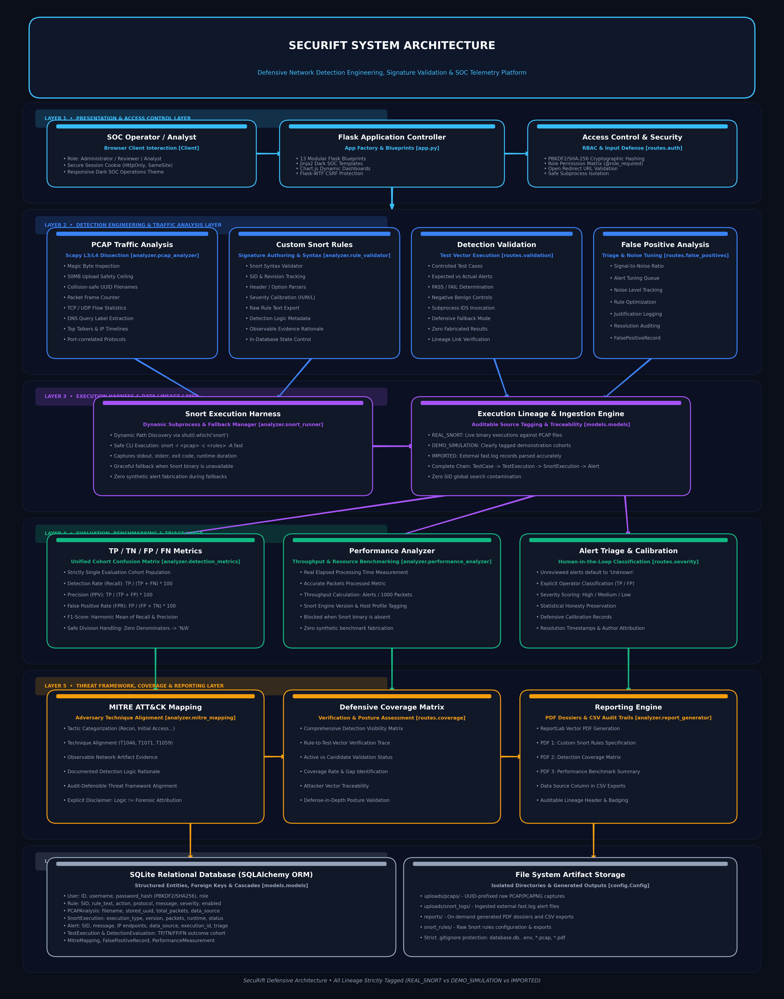
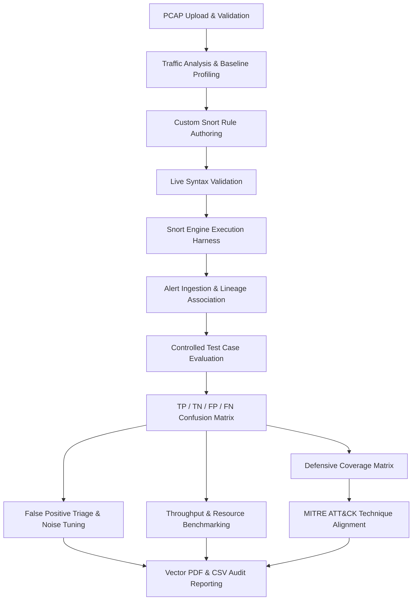

# SecuRift — Defensive Network Detection Engineering Platform

A Flask-based defensive network detection engineering platform for PCAP analysis, custom Snort rules, detection validation, false-positive analysis, MITRE ATT&CK mapping, and security reporting.

[](https://www.python.org/)
[](https://flask.palletsprojects.com/)
[](https://www.sqlite.org/)
[](https://scapy.net/)
[-critical)](https://www.snort.org/)
[](https://attack.mitre.org/)
[](#testing--verification)
[](#security-model--controls)

---

## Project Overview

**SecuRift** is an academic cybersecurity engineering platform designed to bridge the gap between network packet inspection, signature authoring, and detection accuracy quantification.

In enterprise Security Operations Centers (SOC) and Detection Engineering teams, security analysts cannot merely write signatures; they must empirically evaluate rule efficacy, isolate detection gaps (False Negatives), quantify alert fatigue and operational noise (False Positives), benchmark rule processing performance against network captures, and map defensive visibility against adversary tactics and techniques.

SecuRift provides a structured, auditable workflow that decouples and tracks each stage of the detection lifecycle:

1. **Traffic Ingestion & Baseline Analysis**: Structured PCAP/PCAPNG parsing, packet framing, and protocol identification.
2. **Rule Management**: Custom Snort signature authoring, live syntax checking, and metadata tracking.
3. **Detection Execution**: Subprocess execution against live Snort engines or controlled demonstration execution harnesses.
4. **Alert Processing & Lineage**: Strict association linking test vectors, execution instances, captures, and alert logs.
5. **Detection Validation**: Expected versus actual outcome verification across positive and negative controls.
6. **Metric Calculation**: Statistically sound confusion-matrix evaluation across a unified cohort.
7. **False-Positive Analysis & Noise Tuning**: Human-in-the-loop alert triage, signal-to-noise ratio calculation, and rule optimization.
8. **Threat Mapping**: MITRE ATT&CK alignment based on observable packet evidence and documented detection logic.
9. **Defensive Reporting**: Vector-rendered PDF technical dossiers and CSV audit trail exports.

### 🛡️ Core Defensive Mandate

SecuRift is **STRICTLY DEFENSIVE**. The platform contains **zero** attack generation modules, exploit payloads, packet crafters, flood triggers, brute-force engines, or scanning utilities. All evaluations are conducted passively against pre-recorded network capture files (`.pcap`/`.pcapng`) or authenticated external Snort alert logs.

---

## Architecture

The platform follows a modular, layered detection-engineering architecture separating web presentation, access control, network analysis, signature execution, metric calculation, threat framework mapping, reporting, and persistent storage:



### Architectural Layers

```
INPUT (PCAP Ingestion & Snort Rules)
   ↓
ANALYSIS (Scapy L3/L4 Dissection & Syntax Validation)
   ↓
DETECTION (Snort Execution Harness & Fallback Handler)
   ↓
VALIDATION (Execution Lineage & Expected vs Actual)
   ↓
METRICS (Unified Confusion Matrix & Safe Division N/A)
   ↓
THREAT MAPPING (MITRE ATT&CK & Defensive Coverage Matrix)
   ↓
REPORTING (ReportLab Vector PDFs & CSV Audit Exports)
   ↓
PERSISTENCE (SQLite Relational Schema & Isolated Artifact Store)
```

1. **Presentation Layer**: Responsive dark Security Operations Center (SOC) interface constructed with Vanilla CSS3 custom design tokens, modular Jinja2 template partials, and dynamic Chart.js data visualizations.
2. **Application & Security Layer**: 13 modular Flask blueprints, Flask-Login user session state, role-based access control (`Administrator`, `Reviewer`, `Analyst`), Flask-WTF CSRF tokens on all state-altering endpoints, secure HTTP headers, and open-redirect mitigation.
3. **Network Analysis Layer**: Scapy-based L3/L4 packet dissection, magic-byte capture verification, 50 MB upload ceiling, collision-safe UUID filename sanitization, TCP/UDP flow statistics, DNS query label extraction, and top-talker IP traffic timelines.
4. **Detection Engineering Layer**: Custom Snort rule CRUD, real-time syntax checking, SID allocation, severity classification, and subprocess execution orchestration (`snort -r <pcap> -c <rules> -A fast`) with dynamic binary path discovery.
5. **Evaluation Layer**: Traceable `TestCase -> TestExecution -> SnortExecution -> Alert` lineage tracking, outcome verification (`PASS`, `NOT DETECTED`, `UNEXPECTED ALERT`), and confusion-matrix determination (`TP`, `TN`, `FP`, `FN`, `UNKNOWN`).
6. **Security Analytics Layer**: Unified evaluation population metrics (Detection Rate / Recall, Precision, False Positive Rate, F1-Score, Accuracy), alert triage queue, signal-to-noise ratio monitoring, rule-to-test-case coverage matrix, and MITRE ATT&CK technique mapping.
7. **Reporting Layer**: ReportLab vector PDF generation (Rules Specification, Coverage Matrix, Performance Summary) and CSV audit logging with explicit `Data Source` provenance markers.
8. **Persistence Layer**: Relational SQLite database managed via Flask-SQLAlchemy with foreign key integrity and cascade policies, paired with isolated file-system storage for raw PCAPs, ingested alert logs, and compiled reports.

---

## Detection Engineering Workflow

When validating a detection signature, the platform executes a deterministic 12-stage workflow:



1. **PCAP Upload & File Validation**: Magic bytes are verified (`\xd4\xc3\xb2\xa1`, `\xa1\xb2\xc3\xd4`, etc.), size is capped at 50 MB, and the file is assigned a collision-safe UUID prefix.
2. **Traffic Analysis & Baseline Profiling**: Scapy inspects L3/L4 framing, aggregates IP endpoints, counts packet protocols, and computes talker volume.
3. **Signature Authoring & Syntax Check**: Custom Snort rules are parsed for valid actions, protocols, directional operators, SIDs, and balanced option delimiters.
4. **Execution Harness**: If Snort is installed, the binary executes via parameterized subprocess. If absent, defensive fallback engages with zero synthetic fabrication.
5. **Alert Ingestion & Lineage**: Generated or uploaded alerts are linked to a specific `SnortExecution` and `PCAPAnalysis` entity.
6. **Test Case Evaluation**: Outcome is evaluated against expected detection behavior (`Alert` vs `No Alert`).
7. **Confusion Matrix Generation**: Cohort results map strictly to `TP`, `TN`, `FP`, `FN`, or `UNKNOWN`.
8. **Noise Tuning & Triage**: Analysts review alerts, tag false alarms, log operational justifications, and adjust rule thresholds.
9. **Performance Benchmarking**: Real execution elapsed time and alert density (alerts per 1,000 packets) are recorded when Snort is available.
10. **Coverage Analysis**: Test vectors are tracked across active versus candidate detection rules to isolate detection gaps.
11. **MITRE ATT&CK Alignment**: Signatures are mapped to adversary tactics and techniques based on observable packet evidence.
12. **Audit & Report Export**: Results stream to cryptographically auditable vector PDF dossiers and CSV records.

---

## Data Lineage & Provenance Tracking

To maintain scientific defensibility and prevent data contamination, SecuRift strictly differentiates between real detection executions, imported logs, and demonstration data:

| Entity | Real Execution Identifier | Imported Data Identifier | Demo / Simulated Identifier |
| :--- | :--- | :--- | :--- |
| **Snort Executions** | `execution_type = REAL_SNORT` | `execution_type = IMPORTED` | `execution_type = DEMO_SIMULATION` |
| **Alerts** | `data_source = REAL_SNORT` | `data_source = IMPORTED_SNORT_LOG` | `data_source = DEMO` |
| **PCAPs** | `data_source = REAL` | `data_source = REAL` | `data_source = DEMO` |
| **Test Cases** | `data_source = REAL` | `data_source = IMPORTED` | `data_source = DEMO` |
| **Performance** | `measurement_type = REAL_SNORT` | `N/A` (Not Benchmarked) | `measurement_type = DEMO_SIMULATION` |

> [!IMPORTANT]
> **Data Integrity Principle**:  
> `DEMO_SIMULATION` data is never presented as real Snort detection. Real Snort performance benchmarks are executed only when the real `snort` binary is present on the host. When Snort is absent, real benchmarking is safely disabled to prevent the fabrication of synthetic performance statistics.

---

## Core Features

### 1. Network Traffic Analysis
* **Format Support**: Validates and parses `.pcap` and `.pcapng` packet capture files.
* **Header & Framing Dissection**: Deep parsing of Ethernet, IP, TCP, UDP, ICMP, and DNS layers via Scapy.
* **Protocol Breakdown**: Port-correlated protocol classification (`HTTP-like TCP/80`, `HTTPS/TLS-like TCP/443`, `DNS UDP/53`).
* **Conversation Telemetry**: Aggregation of Top Talker source/destination IP pairs, port usage, and packet timestamp timelines.
* **Storage Isolation**: Raw captures stored with 12-character UUID prefixes to prevent filename collision.

### 2. Detection Engineering & Snort Rules
* **Signature Authoring**: Full CRUD interface for custom Snort rules with real-time in-browser syntax validation.
* **Syntax Engine**: Validates rule headers (`action`, `protocol`, `src_ip`, `src_port`, `direction`, `dst_ip`, `dst_port`), options syntax, and balanced parentheses.
* **Metadata Tracking**: SID allocation, revision indexing, severity tagging (`High`, `Medium`, `Low`), and activation toggles.
* **Detection Logic Documentation**: Structured documentation of observable network indicators and technical rationale.
* **Signature Export**: On-demand download of raw rules formatted for deployment into operational IDS sensors.

### 3. Detection Validation & Test Cases
* **Controlled Test Cases**: Systematic mapping of network test vectors (PCAPs) to expected detection behaviors (`Alert` vs `No Alert`).
* **Traceable Execution Lineage**: Every test execution is explicitly linked:
  $$\text{TestCase} \longrightarrow \text{TestExecution} \longrightarrow \text{PCAPAnalysis} \longrightarrow \text{SnortExecution} \longrightarrow \text{Alert}$$
* **Negative Controls**: Inclusion of strictly benign captures (e.g. `sample_benign_traffic.pcap`) to verify baseline silence.
* **Fallback Behavior**: Defensive fallback blocks real benchmark execution when Snort is absent, preventing synthetic metrics.

### 4. Detection Metrics & Mathematical Rigor
* **Unified Evaluation Population**: Confusion matrix metrics derive exclusively from a single coherent cohort of `DetectionEvaluation` records.
* **Mathematical Zero-Division Defense**: When denominators equal zero, formulas safely return `N/A` rather than misleading percentages:
  $$\text{Detection Rate (Recall)} = \frac{\text{TP}}{\text{TP} + \text{FN}} \times 100$$
  $$\text{Precision (PPV)} = \frac{\text{TP}}{\text{TP} + \text{FP}} \times 100$$
  $$\text{False Positive Rate (FPR)} = \frac{\text{FP}}{\text{FP} + \text{TN}} \times 100$$
  $$\text{Accuracy} = \frac{\text{TP} + \text{TN}}{\text{TP} + \text{TN} + \text{FP} + \text{FN}} \times 100$$
  $$\text{F1-Score} = 2 \times \frac{\text{Precision} \times \text{Recall}}{\text{Precision} + \text{Recall}}$$

### 5. SOC Telemetry & False-Positive Analysis
* **Human-in-the-Loop Triage**: Unreviewed alerts default to `Unknown`; alerts become `True Positive` or `False Positive` only after explicit operator review.
* **Signal-to-Noise Ratio (SNR)**: Real-time calculation of operational noise to identify high-chaff signatures.
* **Justification Auditing**: Structured logging of tuning justifications and operator attribution for suppression rules.
* **Defensive Coverage Matrix**: Matrix view aligning custom signatures with validated test cases and validation status (`Active`, `Candidate`).
* **MITRE ATT&CK Mapping**: Technique alignment (e.g., `T1046 Network Service Scanning`, `T1071 Application Layer Protocol`) based on observable packet evidence.

### 6. Technical Reporting & Audit Trails
* **ReportLab Vector PDFs**:
  1. *Custom Snort Rules Specification*: Comprehensive signature documentation, options breakdown, and deployment guides.
  2. *Detection Coverage Matrix*: Security posture evaluation, test vector mapping, and ATT&CK alignment.
  3. *Performance Benchmark Report*: Throughput rates, elapsed execution times, and packet processing densities.
* **CSV Audit Trails**: Instant export of raw rules, coverage matrices, and benchmark metrics with mandatory `Data Source` auditing columns.

---

## Technology Stack

| Layer | Technology | Version | Purpose in SecuRift |
| :--- | :--- | :--- | :--- |
| **Backend Framework** | Python / Flask | 3.1.0 | Application factory, modular blueprint routing, and server-side logic |
| **Database & ORM** | SQLite 3 / Flask-SQLAlchemy | 3.1.1 | Relational database persistence, foreign keys, and model cascades |
| **Network Dissection** | Scapy | 2.7.0 | L3/L4 frame extraction, packet header dissection, and traffic profiling |
| **Network Utilities** | Wireshark / tshark | Optional CLI | Dynamic companion inspection on supported host systems |
| **IDS Engine** | Snort 2.9 | Optional CLI | Subprocess execution harness for real signature detection benchmarking |
| **Web Presentation** | HTML5 / Vanilla CSS3 | Custom | High-contrast dark SOC interface with responsive CSS design tokens |
| **Data Visualization** | Chart.js | 4.4.x | Real-time interactive charts for protocol distributions and alert volume |
| **Session & Auth** | Flask-Login | 0.6.3 | User authentication, session management, and credential verification |
| **Application Defense** | Flask-WTF / WTForms | 1.2.2 / 3.2.1 | Cryptographic CSRF token enforcement and form parameter sanitization |
| **Threat Intelligence** | MITRE ATT&CK | Enterprise | Adversary tactics and techniques alignment framework |
| **Report Generation** | ReportLab | 5.0.3 | High-fidelity vector PDF generation for security compliance dossiers |
| **Test Engineering** | Pytest / Werkzeug | 9.1.1 / 3.1.3 | Automated unit, route, security, and end-to-end integration testing |

---

## Application Screenshots

The following screenshots capture the live SecuRift platform operating in a local demonstration environment:

### 1. Security Operations Dashboard

*High-visibility SOC telemetry overview featuring active rule counts, alert severity distribution, baseline protocol breakdown, and cohort confusion-matrix summary.*

### 2. PCAP Traffic Analysis & Baseline Profiling

*Deep packet inspection breakdown detailing total packet counts, protocol distribution, top talking endpoints, and communication flow timelines.*

### 3. Detection Test Cases Matrix

*Controlled detection test vectors linking specific PCAPs to expected detection outcomes, execution statuses, and execution provenance markers.*

### 4. Custom Snort Rules Management

*Signature engineering workstation showing custom Snort rules, SID allocations, revision indexing, severity classifications, and syntax status.*

### 5. Detection Validation & Outcomes

*Execution-linked validation table displaying concrete test executions, expected vs. actual outcomes, and confusion-matrix classifications.*

### 6. Signature Performance & Fallback Handling

*Performance benchmarking module showing the defensive fallback notice: when Snort is absent on the host, real benchmarking is blocked to prevent fabrication.*

### 7. Defensive Detection Coverage Matrix

*Holistic visibility matrix mapping custom signatures against verified test vectors, validation statuses, and overall detection coverage.*

### 8. False Positive Triage & Noise Tuning

*Alert triage queue providing signal-to-noise ratio monitoring, operator classification actions (TP/FP), and tuning justification logs.*

### 9. PDF Dossiers & CSV Audit Export

*Centralized reporting terminal for generating vector-rendered PDF technical specifications, coverage matrices, and audited CSV data trails.*

---

## Security Model & Controls

SecuRift incorporates defense-in-depth controls implemented specifically for the controlled academic and SOC demonstration deployment:

* **Cryptographic Secret Key Management**: Configured via the `SECURIFT_SECRET_KEY` environment variable. If unset, the application automatically generates a per-run 32-byte cryptographic random secret using Python's `secrets.token_hex(32)`. Hardcoded secret fallbacks have been removed.
* **Global CSRF Protection**: Flask-WTF CSRF protection is enforced globally (`WTF_CSRF_ENABLED = True`). All state-altering POST, PUT, and DELETE requests require valid tokens. In-browser AJAX interactions utilize `<meta name="csrf-token">` and `X-CSRFToken` request headers.
* **Role-Based Access Control (RBAC)**: Implemented via the `@role_required` decorator across three distinct roles:
  * `Administrator`: Full access, including rule deletion, test case purging, and configuration.
  * `Reviewer`: Signature authoring, alert triage, TP/FP classification, and severity tuning.
  * `Analyst`: Read-only telemetry viewing, PCAP analysis, test validation, and report downloads.
  Unauthorized access attempts immediately return `HTTP 403 Forbidden`.
* **Password Hashing**: User credentials are stored using PBKDF2 with SHA-256 and unique cryptographic salts managed via Werkzeug security primitives.
* **File Upload Security & Magic-Byte Validation**: File uploads are restricted to `.pcap` and `.pcapng` extensions and subject to a strict 50 MB ceiling (`MAX_CONTENT_LENGTH`). Every uploaded binary stream undergoes magic-byte inspection verifying valid pcap headers (`\xd4\xc3\xb2\xa1`, `\xa1\xb2\xc3\xd4`, `\x4d\x3c\xb2\xa1`, `\xa1\xb2\x3c\x4d`, `\x0a\x0d\x0d\x0a`).
* **Path Traversal & Storage Isolation**: Uploaded filenames are sanitized via `werkzeug.utils.secure_filename` and assigned a collision-safe 12-character hexadecimal UUID prefix (`{uuid.uuid4().hex[:12]}_{filename}`). Files are stored in isolated upload directories.
* **Open Redirect Defense**: The authentication endpoint strictly validates redirect targets using `is_safe_url()`, rejecting external hostnames and protocol-relative URLs.
* **Safe Subprocess Invocation**: When invoking external binaries (Snort, tshark), arguments are passed as explicit parameter arrays with `shell=False` to eliminate shell injection vulnerabilities.
* **Loopback Network Binding**: By default, the application binds strictly to `127.0.0.1:5000` to prevent unintended exposure of the development server on public interfaces.

Additional security details are documented in [SECURITY.md](SECURITY.md).

---

## Testing & Verification

Automated application tests and workflow validations were successfully executed in the verification test environment:

```
============================================================
  SECURIFT VERIFICATION SUMMARY
============================================================
Python Bytecode Compilation : PASSED (python -m compileall -q .)
Automated Test Suite        : 40 PASSED (pytest -q)
End-to-End SOC Verification : 18 / 18 STAGES PASSED (test_e2e_workflow.py)
Hardcoded Credential Audit  : ZERO OCCURRENCES (verified via repository grep)
============================================================
```

### Automated Test Breakdown (40 Tests)

* **`tests/test_detection_engine.py`**: Validates confusion-matrix logic, unified population coherence, unreviewed alert `Unknown` status handling, Snort execution data lineage, and demo vs. real data separation.
* **`tests/test_security_hardening.py`**: Verifies dynamic secret key generation, open-redirect mitigation, global CSRF enforcement, RBAC authorization blocks, magic-byte header validation, UUID collision safety, and directory traversal rejection.
* **`tests/test_performance_and_reports.py`**: Tests performance fallback when Snort is absent, mock Snort execution capturing elapsed runtime, ReportLab PDF rendering, and CSV `Data Source` auditing columns.
* **`tests/test_rules.py`**: Verifies Snort syntax parser, missing SID detection, balanced parentheses validation, and rule state changes.
* **`tests/test_pcap.py`**: Tests Scapy frame dissection, empty/corrupt capture rejection, and fast alert text parsing.
* **`tests/test_metrics.py`**: Confirms safe zero-division handling (`N/A`), mathematical recall/precision formulas, and noise efficiency metrics.
* **`tests/test_routes.py`**: Tests authentication lifecycle, protected endpoints, and report streaming.

### 18-Stage End-to-End Workflow Verification

The deterministic script `test_e2e_workflow.py` validates the complete operational lifecycle:
1. Operator authentication & session establishment
2. Custom Snort rule creation (SID: 1000099)
3. Live rule syntax and structure validation
4. PCAP capture upload with UUID collision defense
5. Controlled detection test case registration (TC-E2E-100)
6. Host Snort binary inspection & fallback validation
7. Auditable `SnortExecution` creation
8. Alert ingestion and execution lineage linkage
9. Capture-to-alert relationship mapping
10. Concrete test execution evaluation
11. Confusion-matrix classification (True Positive)
12. Single-cohort unified metrics calculation
13. Alert triage queue classification
14. Signature performance benchmark fallback verification
15. Defensive coverage matrix rendering
16. MITRE ATT&CK technique alignment (T1071.E2E)
17. Vector PDF report generation (Rules, Coverage, Performance)
18. CSV audit trail exports with data source markers

---

## Controlled Demonstration Metrics

When initialized using `seed_demo.py`, SecuRift loads a controlled demonstration evaluation cohort designed to exercise every stage of the validation pipeline:

| Evaluation Metric | Demonstration Cohort Value | Mathematical Basis / Population Context |
| :--- | :---: | :--- |
| **Detection Rate (Recall)** | **75.00%** | $\frac{\text{TP}}{\text{TP} + \text{FN}} = \frac{3}{3 + 1} \times 100$ |
| **Precision (PPV)** | **75.00%** | $\frac{\text{TP}}{\text{TP} + \text{FP}} = \frac{3}{3 + 1} \times 100$ |
| **False Positive Rate (FPR)** | **33.33%** | $\frac{\text{FP}}{\text{FP} + \text{TN}} = \frac{1}{1 + 2} \times 100$ |
| **Accuracy** | **71.43%** | $\frac{\text{TP} + \text{TN}}{\text{TP} + \text{TN} + \text{FP} + \text{FN}} = \frac{3 + 2}{3 + 2 + 1 + 1} \times 100$ |
| **F1-Score** | **75.00%** | $2 \times \frac{75.0 \times 75.0}{75.0 + 75.0}$ |
| **Evaluated Sample Size** | **7 Test Vectors** | Coherent population ($3\text{ TP} + 1\text{ FN} + 2\text{ TN} + 1\text{ FP}$) |

> [!NOTE]
> **Demonstration Context Disclaimer**:  
> These metrics derive strictly from the controlled demonstration cohort generated for evaluation and testing. They demonstrate the statistical mechanics of the calculation engine and must **not** be interpreted as production IDS accuracy or real-world detection efficacy.

---

## Limitations

As an academic cybersecurity engineering project, SecuRift operates within documented boundaries:
* **Offline Capture Processing**: Packet inspection is conducted on pre-recorded capture files (`.pcap`/`.pcapng`) rather than live, inline wire-speed network interfaces.
* **Single-Node Storage**: The project utilizes SQLite for local, single-node evaluation; high-throughput enterprise deployments would require a multi-threaded database (e.g., PostgreSQL) with connection pooling.
* **Port-Correlated Protocols**: Application layer labeling (`HTTP-like`, `HTTPS/TLS-like`, `DNS`) is correlated from standard port numbers and header inspection, not full stream reassembly.
* **Host Snort Dependency**: Live detection benchmarking requires an operational Snort 2.9 binary installed on the host system. When Snort is absent, real benchmarking is disabled.
* **Demonstration Metrics Scope**: Demonstration values reflect a controlled sample population of 7 test cases, constructed to test edge cases (such as zero-division and negative controls) rather than evaluate enterprise detection coverage.

---

## Installation & Quick Start

### Prerequisites
* Python 3.10, 3.11, 3.12, or 3.13
* `git` and `pip`
* *(Optional)* `snort` (version 2.9.x) and `tshark` for live host execution

### Step 1: Clone Repository
```bash
git clone https://github.com/MyanaViraj/SecuRift.git
cd SecuRift
```

### Step 2: Create and Activate Virtual Environment
```bash
python3 -m venv .venv

# Linux / macOS:
source .venv/bin/activate

# Windows PowerShell:
.venv\Scripts\Activate.ps1
```

### Step 3: Install Required Dependencies
```bash
pip install -r requirements.txt
```

### Step 4: Configure Environment Variables
Copy `.env.example` to `.env`:
```bash
cp .env.example .env
```

Generate a secure secret key and set your local demonstration password:

**Linux / Kali Linux / macOS:**
```bash
export SECURIFT_SECRET_KEY="$(python3 -c 'import secrets; print(secrets.token_hex(32))')"
export SECURIFT_DEMO_PASSWORD="your-secure-demo-password"
```

**Windows PowerShell:**
```powershell
$env:SECURIFT_SECRET_KEY = [System.BitConverter]::ToString([System.Security.Cryptography.RandomNumberGenerator]::GetBytes(32)).Replace('-','').ToLower()
$env:SECURIFT_DEMO_PASSWORD = "your-secure-demo-password"
```

> [!CAUTION]
> Never commit a `.env` file containing real credentials to version control. SecuRift includes `.env` in `.gitignore` by default.

### Step 5: Seed Demonstration Database
Configure `SECURIFT_DEMO_PASSWORD` in your local environment or `.env` before running the seed script. Never reuse demonstration credentials in production environments:
```bash
python3 seed_demo.py
```

*Created Operator Account:*
- **Username**: `admin`
- **Password**: Configured via `SECURIFT_DEMO_PASSWORD`
- **Role**: `Lead Security Architect` (Administrator)

### Step 6: Launch Application
```bash
python3 app.py
```
Open your browser and navigate to: **http://127.0.0.1:5000**

---

## Kali Linux / Debian Companion Setup

To run detection rules with live `snort` and `tshark` binaries on Debian-based distributions:

```bash
# Update repository index
sudo apt-get update

# Install Snort IDS (Optional)
sudo apt-get install -y snort

# Install Wireshark / tshark (Optional)
sudo apt-get install -y tshark
```

SecuRift dynamically detects these tools on system PATH via `shutil.which()`. When present, live execution mode engages automatically. When absent, defensive fallback mode ensures seamless operation without crashes or fabricated measurements.

---

## Project Structure

```text
SecuRift/
├── analyzer/                        # Network & Detection Analysis Modules
│   ├── __init__.py
│   ├── detection_metrics.py         # Confusion matrix & safe-division metrics
│   ├── mitre_mapping.py             # MITRE ATT&CK technique definitions
│   ├── pcap_analyzer.py             # Scapy L3/L4 packet frame dissection
│   ├── performance_analyzer.py      # Execution throughput & runtime profiling
│   ├── report_generator.py          # ReportLab vector PDF dossier generation
│   ├── rule_validator.py            # Custom Snort rule syntax & SID validation
│   ├── snort_parser.py              # Fast alert log parser (fast.log format)
│   └── snort_runner.py              # Subprocess execution harness & binary discovery
├── docs/                            # Documentation & Architecture Assets
│   ├── architecture/
│   │   └── securift-architecture.png # System architecture diagram
│   └── screenshots/                 # Application interface captures (01 to 09)
├── models/                          # Database Schema & Extensions
│   ├── __init__.py                  # SQLAlchemy, LoginManager & CSRF init
│   └── models.py                    # Relational models & execution lineage entities
├── reports/                         # Local Generated PDF & CSV Storage (.gitkeep)
├── routes/                          # Modular Flask Route Blueprints
│   ├── __init__.py
│   ├── auth.py                      # Login, logout, session & password management
│   ├── baseline.py                  # PCAP upload, validation & traffic analysis
│   ├── coverage.py                  # Defensive detection coverage matrix
│   ├── dashboard.py                 # Centralized SOC telemetry & metric overviews
│   ├── detection_logic.py           # Documented detection logic & rationale
│   ├── false_positives.py           # Alert triage, SNR monitoring & tuning queue
│   ├── mitre.py                     # ATT&CK tactic & technique mapping views
│   ├── performance.py               # Snort benchmark runner & fallback display
│   ├── reports.py                   # On-demand PDF generation & CSV export routes
│   ├── rules.py                     # Custom Snort rule authoring & export
│   ├── severity.py                  # Alert severity breakdown & risk triage
│   ├── snort.py                     # IDS environment check & external log ingestion
│   └── test_cases.py                # Detection test vector registration & tracking
├── static/                          # Front-End Static Assets
│   ├── css/
│   │   └── style.css                # Dark SOC theme & custom CSS design tokens
│   └── js/
│       └── app.js                   # Client-side UI interactions & dynamic helpers
├── templates/                       # Jinja2 HTML Templates (Dark SOC Theme)
│   ├── base.html                    # Master layout with navigation & security headers
│   ├── baseline.html                # PCAP dissection & conversation dashboard
│   ├── coverage.html                # Detection coverage matrix template
│   ├── dashboard.html               # Main security operations console
│   ├── detection_logic.html         # Detection engineering rationale
│   ├── false_positives.html         # Noise tuning & alert triage interface
│   ├── login.html                   # Authentication portal (no hardcoded credentials)
│   ├── mitre.html                   # MITRE ATT&CK alignment matrix
│   ├── performance.html             # Performance benchmarking & fallback notices
│   ├── reports.html                 # Technical report download center
│   ├── rule_form.html               # Rule authoring modal & syntax checker
│   ├── rules.html                   # Custom Snort rule registry
│   ├── severity.html                # Alert severity classification table
│   ├── snort.html                   # IDS environment inspector
│   ├── test_cases.html              # Test case registration & outcome tracking
│   └── validation.html              # Concrete detection validation table
├── tests/                           # Pytest Automated Test Suite
│   ├── test_detection_engine.py     # Confusion matrix & cohort lineage tests
│   ├── test_metrics.py              # Metric formulas & zero-division defense
│   ├── test_pcap.py                 # Packet parsing & upload integrity tests
│   ├── test_performance_and_reports.py # Benchmarking & ReportLab PDF tests
│   ├── test_routes.py               # Authentication & blueprint route tests
│   ├── test_rules.py                # Rule syntax & CRUD operations tests
│   └── test_security_hardening.py   # RBAC, CSRF, UUID & traversal security tests
├── uploads/                         # Isolated File Storage (UUID-prefixed)
│   ├── pcaps/                       # Stored PCAP captures
│   └── snort_logs/                  # Ingested external alert logs
├── .env.example                     # Environment template configuration
├── .gitignore                       # Git ignore configuration (secrets, DB, cache)
├── app.py                           # Application entry point & factory invocation
├── config.py                        # Centralized application & testing configuration
├── migrate_database.py              # Schema migration helper
├── pytest.ini                       # Pytest test discovery & execution configuration
├── requirements.txt                 # Pinned project dependencies
├── SECURITY.md                      # Security vulnerability policy & reporting guide
├── seed_demo.py                     # Controlled demonstration dataset seeder
├── test_e2e_workflow.py             # 18-stage end-to-end SOC verification script
└── README.md                        # Master repository documentation
```

---

## Defensive Engineering Q&A (Technical Evaluation Rationale)

### Q1: Why must real Snort benchmarks never be mixed with simulated or estimated data?
**Answer:** In detection engineering, combining measured execution times with synthetic alert estimates invalidates the benchmark. A performance metric is only valid if an actual Snort binary processed specific packet frames using specific rule options. Estimating alerts from packet counts creates fabricated throughput statistics that fail to reflect CPU cycle consumption, memory cache misses, or PCRE evaluation costs. When Snort is unavailable, SecuRift explicitly blocks benchmarking instead of synthesizing numbers.

### Q2: Why is global SID searching (`Alert.query.filter_by(sid=...)`) inadequate for detection validation?
**Answer:** Global SID lookups only determine whether an alert exists anywhere in historical records, not whether the signature fired on a specific test vector during a specific evaluation. SecuRift enforces strict execution lineage:
$$\text{TestCase} \longrightarrow \text{TestExecution} \longrightarrow \text{PCAPAnalysis} \longrightarrow \text{SnortExecution} \longrightarrow \text{Alert}$$
Validation proves that the signature fired during that exact run against that specific traffic capture.

### Q3: Why should unreviewed alerts remain "Unknown" rather than assuming they are True Positives?
**Answer:** Assuming unreviewed alerts are True Positives inflates detection rates and masks operational noise. In SOC operations, an alert is merely an unverified signal. Until a human analyst or ground-truth oracle confirms it as legitimate malicious activity, it remains `Unknown`. This preserves statistical honesty.

### Q4: Why does safe division return `N/A` instead of `0%` when a denominator is zero?
**Answer:** Mathematically, $\frac{0}{0}$ is undefined. In detection metrics, if zero attack vectors were evaluated ($\text{TP} + \text{FN} = 0$), reporting a Detection Rate of $0\%$ would falsely indicate that the signature failed to catch attacks. In reality, no attacks occurred to evaluate. Returning `N/A` accurately conveys insufficient evaluation data.

### Q5: What is the purpose of mapping rules to MITRE ATT&CK if they are not forensic evidence?
**Answer:** SecuRift follows detection engineering guidelines: *"Detection mapping based on documented detection logic."* The mapping specifies which adversary technique the signature was designed to detect based on observable packet artifacts (e.g., `cmd.exe` in an HTTP URI mapped to `T1059.003`), without asserting conclusive forensic threat actor attribution.

---

## Project Status

SecuRift is an academic cybersecurity engineering project developed for defensive network detection engineering, signature validation, and SOC telemetry.

* **Automated Test Coverage**: 40 automated tests passing across detection, metrics, rules, and security controls.
* **End-to-End Verification**: 18-stage defensive workflow verified end-to-end.
* **Integrity Guarantee**: Decoupled data sources (`REAL_SNORT`, `DEMO_SIMULATION`, `IMPORTED`) with zero fabricated performance statistics.
